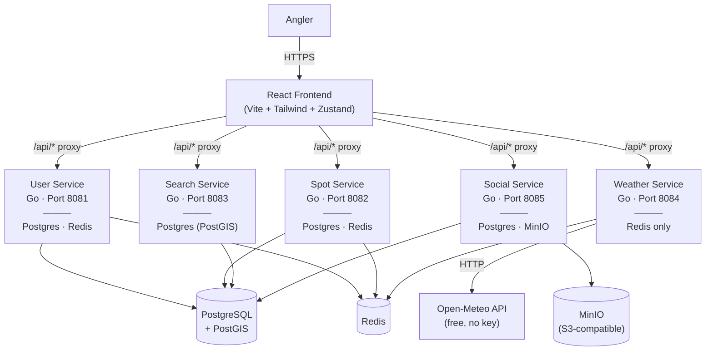
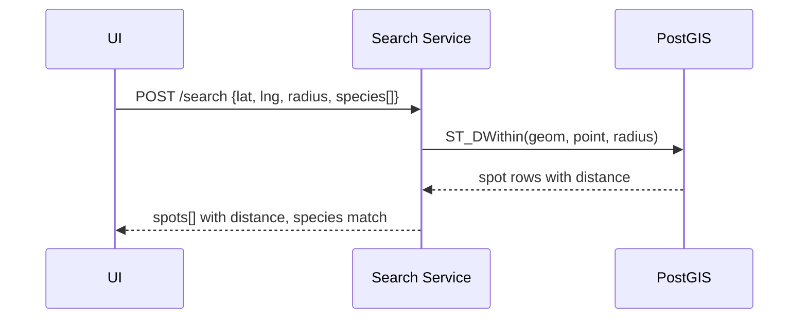
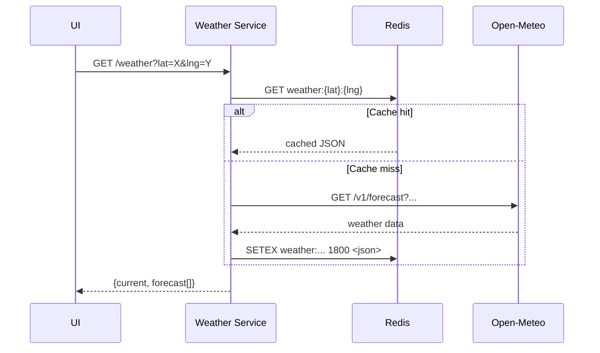
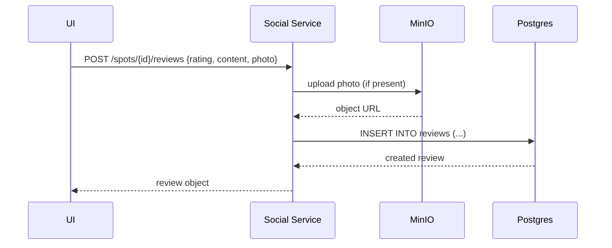

# FishFinder — High-Level Design

## Purpose

FishFinder is a fishing spot discovery platform. It helps anglers find fishing spots, check weather conditions, log catches, and share reviews with photos. Built as a practice environment demonstrating Go microservices, React frontend, and cloud-native patterns.

---

## System Context



**External boundaries:**
- Frontend dev server proxies `/api/*` to service ports (localhost for local dev, docker hostnames in compose)
- Open-Meteo API for weather data — free, no authentication
- MinIO for local S3 parity (user photos)

---

## Services

### User Service (Go, Port 8081)
Authentication and user profile management. JWT-based auth, registration, login, profile CRUD. Redis for session/token caching.

### Spot Service (Go, Port 8082)
Core fishing spot data model. CRUD for spots, species catalog, spot-species relationships. Owns all database migrations (even for other services). Postgres with PostGIS for spatial data (`GEOMETRY(Point, 4326)`). Redis for caching spot lookups.

### Search Service (Go, Port 8083)
Spatial search and discovery. PostGIS queries for "spots within X miles of lat/lng", filtering by species, amenities. Read-only from spot data (replicated via shared Postgres, or direct query). No caching layer yet.

### Weather Service (Go, Port 8084)
Real-time weather and forecasts at fishing spots. Calls Open-Meteo API (free, no key). Redis for caching responses (30-minute TTL). No database — stateless design.

### Social Service (Go, Port 8085)
Reviews, ratings, catch logs, and photos. Postgres for reviews and catch_logs tables. MinIO (S3-compatible) for user photo storage. Consumes spot data for review context.

---

## Communication Patterns

| Pattern | Where | Why |
|---|---|---|
| HTTP REST | Frontend → Services | Simple, direct, Vite proxy handles CORS |
| HTTP REST | Service-to-service | None yet — services are independent by design |
| Vite Proxy | Frontend dev → Services | `/api/*` routes to `localhost:8081-8085` in dev, docker hostnames in compose |
| Redis | Cache layer | User sessions, spot lookups, weather responses |

**No inter-service communication yet.** Services are intentionally independent. Future: webhooks or async events if needed.

---

## Key Data Flows

### Spot Search



### Weather Lookup



### Review Submission



---

## Cross-Cutting Concerns

### Authentication and Authorization
- JWT issued at login (user-service), validated by auth middleware in `pkg/auth/`
- `Authorization: Bearer <token>` header on protected endpoints
- Auth middleware extracts user ID and injects into request context
- **Known issue:** `WithUserID` returns `interface{}` instead of `context.Context` — fix before production

### Caching Strategy
| What | Where | TTL | Why |
|---|---|---|---|
| User sessions | Redis (user-service) | 24h | Login state |
| Spot lookups | Redis (spot-service) | 1h | Spot details change rarely |
| Weather data | Redis (weather-service) | 30min | Weather changes, not instantly |

### Database
- PostgreSQL 16 + PostGIS 3.4
- Spots use `GEOMETRY(Point, 4326)` with GIST index for spatial queries
- Migrations: golang-migrate, file-based in `spot-service/internal/repository/migrations/`
- Run from `services/spot-service` (owns all migrations)
- Single Postgres instance for all services (local dev); separate DBs per service in production

### Failure Modes and Resilience
- **Weather API down:** Return stale cache if available, else 503 with user-friendly message
- **MinIO down:** Review submission fails gracefully (no photo), text review still saved
- **Redis down:** Services degrade to direct DB queries (slower but functional)
- **Postgres down:** All services that depend on it return 503

---

## Infrastructure

Managed via Docker Compose (`docker-compose.yml`) for local development.

| Resource | Used By | Notes |
|---|---|---|
| PostgreSQL 16 + PostGIS 3.4 | spot, user, search, social | Shared instance locally |
| Redis | user, spot, weather | Cache + session store |
| MinIO | social | S3-compatible, ports 9000 (API), 9001 (console) |
| LocalStack | (disabled) | Was causing auth issues, not heavily used yet |

---

## CI/CD

Recommended GitHub Actions (future):

1. **Per-service CI:** lint (`golangci-lint`), test (`go test ./...`), build
2. **Frontend CI:** lint, typecheck, build, test (vitest)
3. **Merge to main:** build Docker images, push to registry
4. **Release tag:** deploy to cloud (ECS/Fargate or similar)

---

## Local Development

```bash
make setup     # first run: install air, migrate, npm deps
make up        # start infra only (postgres, redis, minio)
make dev       # infra + all services with hot reload (requires air)
make migrate   # run migrations up (from spot-service)
make seed      # load 10 sample spots + 15 species
make test      # go test ./services/... -v -count=1
```

---

## Repository Structure

```
fishwish/
  services/
    user-service/      # Go — auth, profiles, port 8081
    spot-service/      # Go — spots, species, migrations, port 8082
    search-service/    # Go — PostGIS spatial search, port 8083
    weather-service/   # Go — Open-Meteo API, Redis cache, port 8084
    social-service/    # Go — reviews, catch logs, photos, port 8085
  frontend/           # React + Vite + Tailwind + Zustand
  pkg/                # Shared Go code (auth middleware, etc.)
  docs/
    architecture.md    # This file — HLD
    AI_RULES.md        # Shared AI assistant rules
    sdcl.md            # Software development lifecycle
    adr/              # Architecture Decision Records (immutable)
    backlog.md        # Product backlog
  docker-compose.yml   # Local infra stack
  Makefile            # Dev commands
  AGENTS.md           # Instructions for AI agents
```

---

## Build Order

| # | Service | Status | Notes |
|---|---|---|---|
| 1 | `spot-service` | Scaffolded | Core data model, migrations, seed data |
| 2 | `user-service` | Scaffolded | Auth stubbed (WithUserID returns interface{}) |
| 3 | `search-service` | Scaffolded | PostGIS queries, needs search endpoint |
| 4 | `weather-service` | Scaffolded | Open-Meteo integration, Redis caching |
| 5 | `social-service` | Scaffolded | Reviews, needs photo upload to MinIO |
| 6 | `frontend` | In Progress | React SPA, Vite proxy to services |
